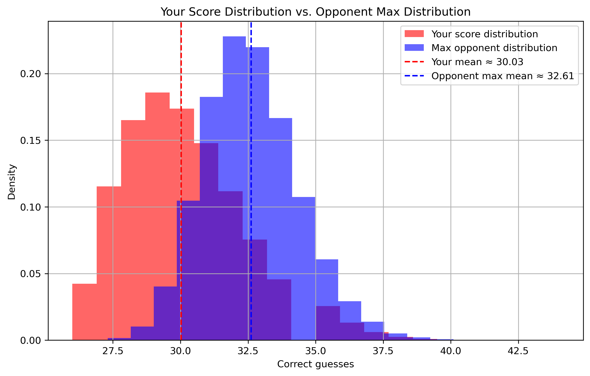
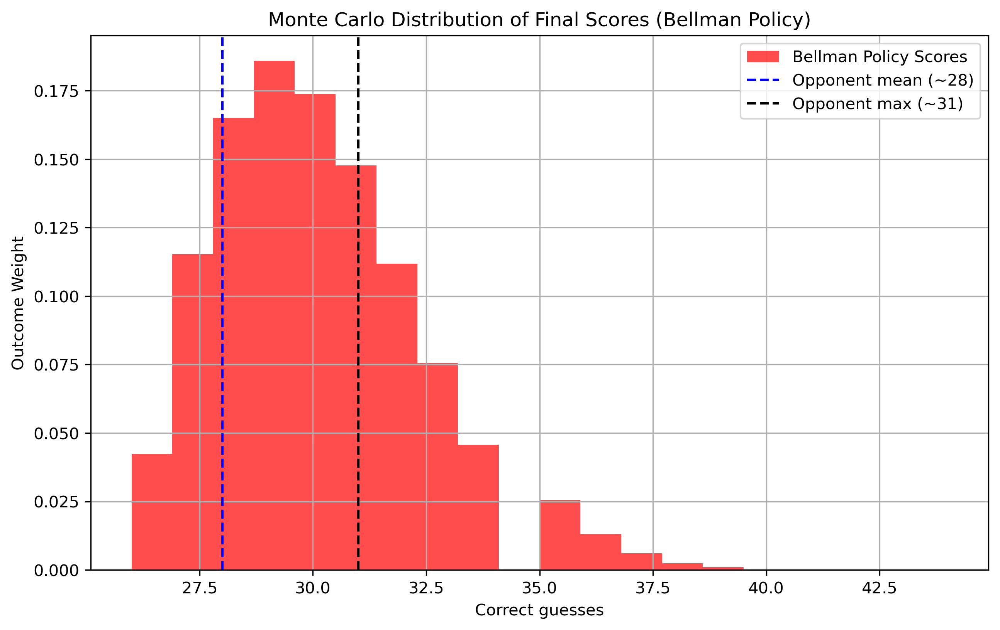
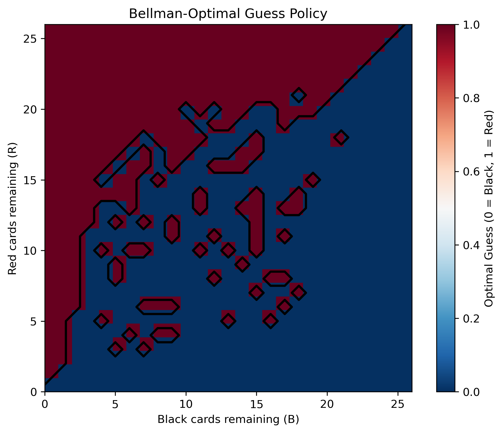

## How to Run

Clone the repository and install dependencies:

```bash
git clone https://github.com/christianFchen/BellmanVisualizationForRandomCards
cd BellmanVisualizationForRandomCards
python -m venv venv
source venv/bin/activate    # On macOS/Linux
venv\Scripts\activate       # On Windows
pip install -r requirements.txt
python BellmanModel.py
```
# Optimal Guessing Strategy Using Markov Decision Processes and Monte Carlo Simulation

## Problem Statement

**Quantitative Question:**  
You are playing a game against 10 opponents with a standard 52-card deck (26 red, 26 black).  
Cards are drawn one by one, and before each draw, you and your opponents guess the card's color.

- You do not know what your opponents guess.  
- You see the color of each card after it is drawn and whether your guess was correct.  
- The player with the most correct guesses wins \$1,000.  
- In case of a tie, the winner is chosen at random.

**Objective:**  
Develop a strategy that maximizes your probability of winning and estimate the success rate.

---

## Methodology

We model this sequential decision-making problem as a **Markov Decision Process (MDP)** and solve it using **dynamic programming (Bellman recursion)**.  
We then validate the approach using **Monte Carlo simulation** against probabilistic opponents.

---

## State Space and Actions

We define the state:

$$
S = (R, B, C)
$$

Where:

- $R$: number of red cards remaining  
- $B$: number of black cards remaining  
- $C$: current number of correct guesses

The possible actions are:

$$
A \in \{\text{Guess Red}, \text{Guess Black}\}
$$

---

## Transition Dynamics

The state transitions depend on the true color drawn (revealed after guessing), updating $R$, $B$, and $C$ accordingly.  
The process continues until $R + B = 0$.

---

## Bellman Optimality Equation

The Bellman value function is defined as:

$$
V(R, B, C) =
\begin{cases}
P(\text{win} \mid C) & \text{if } R + B = 0 \\
\max \{ V_{\text{red}}, V_{\text{black}} \} & \text{otherwise}
\end{cases}
$$

Where:

$$
V_{\text{red}} = \frac{R}{R + B} V(R - 1, B, C + 1) + \frac{B}{R + B} V(R, B - 1, C)
$$

$$
V_{\text{black}} = \frac{B}{R + B} V(R, B - 1, C + 1) + \frac{R}{R + B} V(R - 1, B, C)
$$

The optimal policy selects the action that maximizes $V(R, B, C)$ at every state.

---

## Opponent Modeling

Opponents are modeled as probabilistic guessers with Gaussian-distributed scores:

$$
\text{Score} \sim \mathcal{N}(28, 3^2)
$$

With 10 opponents, the expected maximum score is approximately:

$$
\mathbb{E}[\max] \approx 30.8 - 31.0
$$

---

## Monte Carlo Simulation

We simulate $100{,}000$ games under the Bellman-optimal policy:

1. Shuffle and draw cards sequentially.
2. Use the Bellman-optimal action at each state.
3. Sample opponent scores from $\mathcal{N}(28, 3^2)$.
4. Estimate the probability that our score exceeds the opponents’ maximum.

---

## Results

| Metric | Value |
|--------|-------|
| Mean correct guesses (optimal policy) | ~29.0 |
| Standard deviation | ~2.2 |
| Monte Carlo win probability | ~0.17 – 0.20 |
| Expected opponent max score | ~30.8 – 31.0 |

**Interpretation:**  
Even with optimal play, variance dominates the outcome. However, the Bellman policy improves win probability from approximately 10–12% (random guessing) to 17–20%.

---

## Strategy Breakdown

- **Early Game:** Induce variance by occasionally guessing the minority color to diverge from naive strategies.  
- **Mid Game:** Guess based on conditional probabilities to maximize expected correct guesses.  
- **End Game:**  
  - If ahead: play conservatively.  
  - If behind: increase variance by consistently guessing the minority color.

---

## Visualizations

### 1. Monte Carlo Score Distribution

The histogram shows the distribution of total correct guesses across 100,000 simulations under the Bellman-optimal policy.



---

### 2. Score Distribution vs. Opponent Maximum

Comparison of our score distribution (red) vs. maximum opponent distribution (blue).  
Despite optimization, the heavy right tail of the opponent distribution shows the variance challenge.



---

### 3. Bellman-Optimal Policy Heatmap

Decision boundary of the Bellman-optimal policy.  
Red = optimal to guess red. Blue = optimal to guess black.



---

## Conclusion

This project demonstrates how **Markov Decision Processes** and **Bellman dynamic programming** can optimize decisions in a high-variance competitive guessing game.  
While randomness ensures no guaranteed win, the optimal policy significantly improves the probability of winning against 10 probabilistic opponents.

---

## Project Structure
```
├── BellmanModel.py # Main script running Bellman MDP simulation and Monte Carlo analysis
├── README.md # Documentation, math, results, and usage instructions
├── requirements.txt # Python dependencies
├── .gitignore # Files and directories to ignore in Git
├── LICENSE # Open-source license
├── figures/ # Generated visualizations from simulations
│ ├── bellman_hist_vs_opponentMax.png
│ ├── bellman_histogram_opponent.png
│ └── bellman_heatmap.png
```

